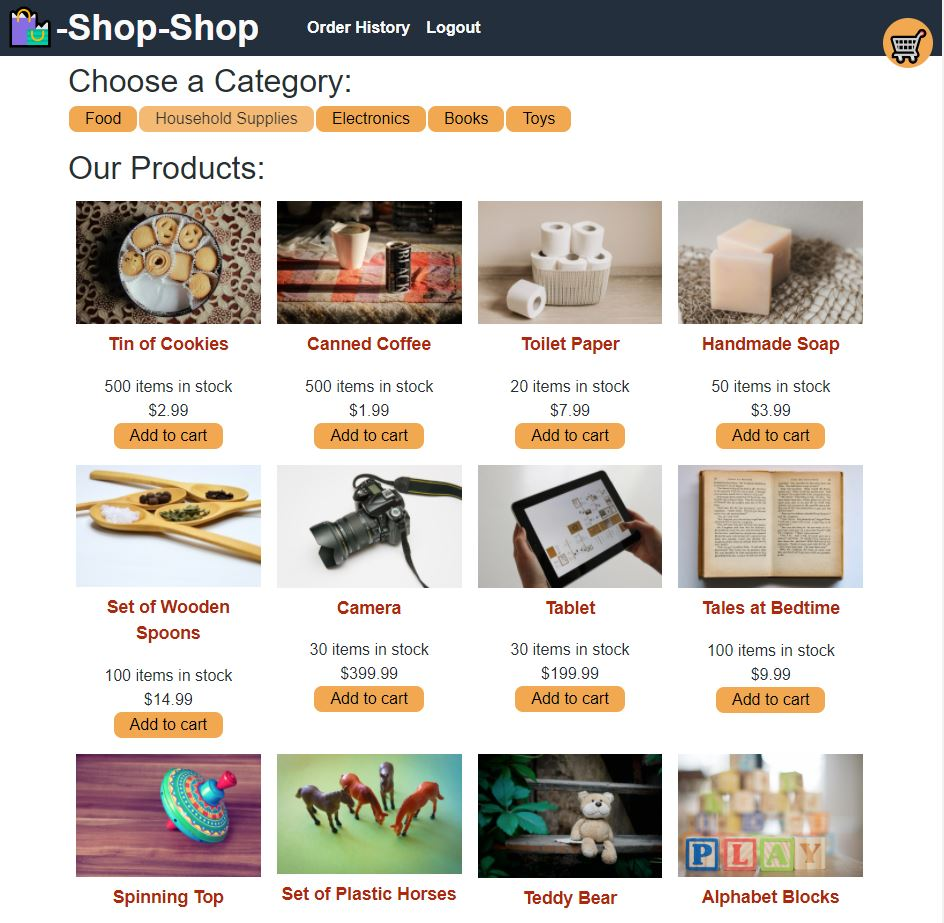

# shop-shop (with Redux Store)

This project consisted of refactoring the e-commerce platform from using React’s Context API to using Redux for Global State.

# Technologies used

* Redux
* React
* MongoDB
* Node.js/Express.js 

# GitHub repository

https://github.com/evkonradi/shop-shop-redux

# Deployed application:

 https://secret-taiga-93993.herokuapp.com/

# Page preview

This is the preview of the initial page:
